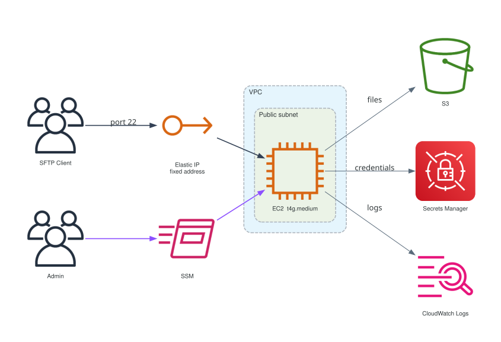

# terraform-aws-sftp

An SFTP endpoint for exchanging files with partners, backed by S3.

Partners connect with a normal SFTP client to a fixed IP. Everything they upload lands
in an S3 bucket, each user locked to their own prefix.

---

## Architecture



Each user is confined to their own prefix in the bucket. Nothing is public, and there is
no SSH access to the host.

---

## Quick start

Two files. Fill in three values, apply.

**1. `sftp.tf`**

```hcl
module "sftp" {
  source = "git::https://github.com/TechHoldingLLC/terraform-aws-sftp.git?ref=v0.0.1"

  name = "<your-project>-<env>"             # prefix for every resource

  vpc_id    = "<vpc-id>"                    # existing VPC
  subnet_id = "<public-subnet-id>"          # existing PUBLIC subnet

  # One YAML file per user in ./users/. Adding a file onboards someone,
  # deleting one offboards them.
  users = [
    for f in fileset("${path.root}/users", "*.{yaml,yml}") :
    yamldecode(file("${path.root}/users/${f}"))
  ]
}

output "sftp" {
  value = module.sftp
}
```

**2. `users/<username>.yaml`**, one per user, filename matching the username
(`.yml` works too)

```yaml
username: <username>
description: <what this account is for>
enable_password: true
```

**3. Apply**

```bash
terraform apply
terraform output -json | ./scripts/sftpctl info
```

```
endpoint: 203.0.113.25
port:     22
bucket:   <your-project>-<env>-sftp
users:
  - <username>
```

Give the partner the endpoint, their username, and their password
(`sftpctl password --user <username>`). That is the whole setup.

Everything else has a working default: instance type, AMI, storage layout, logging and
tuning are all resolved for you. See [Inputs](#inputs) for what you can override.

> **The subnet must be public.** It needs a route to an internet gateway, because
> partners have to reach it and the host pulls packages and talks to AWS APIs without NAT.

> **By default the SFTP port is open to the whole internet.** Set
> `allowed_cidr_blocks` to your partners' egress IPs before going live.

## Operator commands

The module ships **`scripts/sftpctl`** - one self-contained file covering everything you
do day to day. It reads `terraform output -json` on stdin, so it works with Terraform or
Terragrunt, from any directory.

### What to copy

**Copy this:** `scripts/sftpctl` → your repo, anywhere you keep scripts.

```bash
VERSION=v0.0.1
curl -fsSL -o infrastructure/scripts/sftpctl \
  https://raw.githubusercontent.com/TechHoldingLLC/terraform-aws-sftp/$VERSION/scripts/sftpctl
chmod +x infrastructure/scripts/sftpctl
git add infrastructure/scripts/sftpctl
```

### Expose the outputs

`sftpctl` needs the module's outputs. One block is enough - none of them are secret,
the credentials are Secrets Manager ARNs, not values:

```hcl
output "sftp" {
  value = module.sftp
}
```

### Add these Makefile targets

```make
SFTPCTL = infrastructure/scripts/sftpctl

## everything: info, admin, admin-password, password, shell, logs, sync
sftp-%:
	@$(MAKE) -s tfoutput | $(SFTPCTL) $* \
		--profile $(AWS_PROFILE) --region $(AWS_REGION) --user "$(user)"

## replace the instance (~2 min) - for instance-type or volume changes
sftp-rebuild:
	@cd $(TERRAGRUNT_DIR) && terragrunt run -- apply -replace='module.sftp.aws_instance.sftp_ec2'
```

`tfoutput` is whatever already prints `terraform output -json` in your Makefile. The one
pattern rule covers every subcommand - `sftp-rebuild` is separate because it drives
Terraform, not the script.

### Commands

| Command | What it does |
|---|---|
| `make sftp-info` | endpoint, port, bucket, users |
| `make sftp-password user=acme-corp` | that user's generated password |
| `make sftp-admin` | opens the web admin panel on `localhost:8080` via SSM |
| `make sftp-admin-password` | admin panel credentials |
| `make sftp-shell` | shell on the host over SSM, no SSH |
| `make sftp-logs` | tail the live log - every auth attempt with its source IP |
| `make sftp-sync` | re-push the **current** secret. Does not read your YAML - edit a user then run `terraform apply` |
| `make sftp-rebuild` | replace the instance |

Without Make:

```bash
terraform output -json | ./scripts/sftpctl info
terraform output -json | ./scripts/sftpctl password --user acme-corp
```

---
## Inputs

### Required

| Name | Type | Description |
|---|---|---|
| `name` | `string` | Prefix for every resource, e.g. `"myproject-dev"` |
| `vpc_id` | `string` | Existing VPC to attach the host to |
| `subnet_id` | `string` | Existing **public** subnet |

### Common

| Name | Type | Default | Description |
|---|---|---|---|
| `users` | `list(object)` | `[]` | User definitions - see [the `users` object](#the-users-object) |
| `allowed_cidr_blocks` | `list(string)` | `["0.0.0.0/0"]` | Who may reach the SFTP port. **Narrow this** |
| `tags` | `map(string)` | `{}` | Extra tags, merged with provider `default_tags` |
| `sftp_port` | `number` | `22` | Port to listen on |
| `log_retention_days` | `number` | `30` | CloudWatch Logs retention |

### Compute

| Name | Type | Default | Description |
|---|---|---|---|
| `instance_type` | `string` | `"t4g.medium"` | Must be arm64 (Graviton) |
| `ami_id` | `string` | `null` | Resolved automatically to the latest Amazon Linux 2023 arm64. Set only alongside an `instance_type` of a different architecture |
| `root_volume_size` | `number` | `20` | GB. Transfers stage on local disk, so this must exceed largest file × concurrent transfers |

### Storage

| Name | Type | Default | Description |
|---|---|---|---|
| `bucket_versioning` | `bool` | `false` | Keep every object version. **Set at creation - S3 cannot return a versioned bucket to unversioned** |
| `abort_incomplete_multipart_days` | `number` | `7` | Aborts orphaned upload parts, which are billed but invisible in the console |
| `noncurrent_version_expiration_days` | `number` | `14` | Deletes old versions. Only applies when `bucket_versioning` is true |

### Credentials

| Name | Type | Default | Description |
|---|---|---|---|
| `password_length` | `number` | `16` | Generated user and admin passwords. **Changing this rotates every credential** |
| `admin_username` | `string` | `"sftpadmin"` | Web admin panel login |

### Tuning

Defaults are fine for typical partner file exchange. Raise for large files over fast links.

| Name | Type | Default | Description |
|---|---|---|---|
| `sftpgo_version` | `string` | `"2.7.5"` | Server version to install |
| `upload_part_size` | `number` | `16` | S3 multipart size in MB, min 5 |
| `upload_concurrency` | `number` | `4` | Parts in parallel per upload |
| `download_part_size` | `number` | `16` | S3 ranged download size in MB, min 5 |
| `download_concurrency` | `number` | `4` | Parts in parallel per download |

### The `users` object

One object per user. Only `username` is required.

| Field | Type | Default | Description |
|---|---|---|---|
| `username` | `string` | **required** | Login name, and the default S3 prefix |
| `enable_password` | `bool` | `false` | Generate a password and allow password auth |
| `public_keys` | `list(string)` | `[]` | Authorized SSH keys, `authorized_keys` format |
| `key_prefix` | `string` | `"<username>/"` | S3 prefix the user is confined to, must end in `/`. Set `""` for the whole bucket |
| `permissions` | `list(string)` | full read/write | `list`, `download`, `upload`, `overwrite`, `delete`, `rename`, `create_dirs` |
| `quota_size` | `number` | `0` | Max stored bytes, 0 for unlimited |
| `max_sessions` | `number` | `0` | Max concurrent sessions, 0 for unlimited |
| `upload_bandwidth` | `number` | `0` | Upload throttle KB/s, 0 for unlimited |
| `download_bandwidth` | `number` | `0` | Download throttle KB/s, 0 for unlimited |
| `allowed_ip` | `list(string)` | `[]` | Source CIDRs **this user** may log in from. Narrower than `allowed_cidr_blocks`, which gates the port for everyone |
| `expiration_date` | `number` | `0` | Account expiry in unix milliseconds, 0 for never |
| `description` | `string` | `""` | Note shown in the admin panel |

**Authentication follows from what you set** - there is no mode to choose:

| You set | They authenticate with |
|---|---|
| `enable_password: true` | password |
| `public_keys: [...]` | key |
| both | either one, their choice |

Every user needs at least one of the two, or the plan fails.

---

## Outputs

| Name | Description |
|---|---|
| `endpoint` | Address partners connect to (the Elastic IP) |
| `port` | SFTP port |
| `usernames` | Map of username to the S3 prefix each is confined to |
| `bucket_name` | Bucket backing the SFTP tree |
| `passwords_secret_arn` | Secret holding the username → password map |
| `admin_secret_arn` | Secret holding the admin panel credentials |
| `instance_id` | For `aws ssm start-session` |
| `log_group_name` | CloudWatch log group |
| `sync_document_name` | SSM document that pushes user changes |

---

## Cost

**us-west-2, one endpoint, any number of users:**

| Line item | Monthly |
|---|---|
| EC2 t4g.medium, 730 h @ $0.0336 | $24.53 |
| EBS gp3, 20 GB | $1.60 |
| Elastic IP | $3.65 |
| Secrets Manager, 4 secrets | $1.60 |
| CloudWatch Logs, ~2 GB | $1.00 |
| **Fixed total** | **~$32** |

Plus S3 storage at $0.023/GB-month. **Uploads are free**; downloads are free for the
first 100 GB/month, then $0.09/GB.

### Versus AWS Transfer Family

Transfer Family bills **$0.30/hour** per enabled SFTP endpoint and **$0.04/GB** in *both*
directions. Same workload - 500 GB stored, 500 GB uploaded, 100 GB downloaded a month:

| | This module | Transfer Family |
|---|---|---|
| Endpoint | $32 | **$219** |
| Upload 500 GB | free | $20.00 |
| Download 100 GB | free (first 100 GB) | $4.00 |
| S3 storage 500 GB | $11.50 | $11.50 |
| **Monthly** | **~$44** | **~$255** |
---

## Requirements

| | |
|---|---|
| Terraform | **≥ 1.14** |
| Providers | `aws >= 6.56`, `tls >= 4.3`, `random >= 3.9`, `null >= 3.2` - declare all four in your root `required_providers` |
| Subnet | **public**, with a route to an internet gateway |
| IAM | whoever runs Terraform needs `ssm:SendCommand` and `ssm:GetCommandInvocation`, because user changes are pushed over SSM. In CI, add these to the OIDC role |

---

## More

See **[EXAMPLE.md](EXAMPLE.md)** for users from YAML vs inline, permission recipes
(read-only, write-only, shared folders), onboarding and offboarding partners, and the
full command reference.
